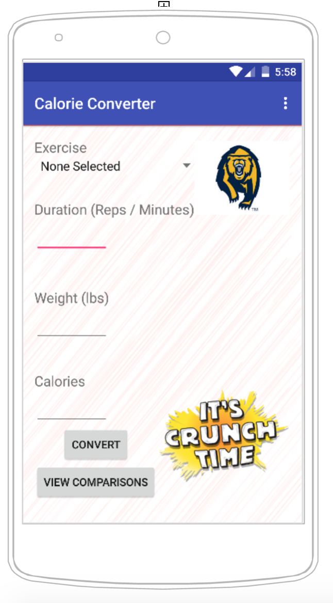

# PROG 01: Crunch Time

Crunch Time Calorie Converter is an application which, given an input of the type and amount of exercise as well as a weight, allows the user to gauge how many calories were burned as well as the equivalent amount of another type of exercise needed.

## Authors

Neil Danait ([neil.danait@berkeley.edu](mailto:neil.danait@berkeley.edu))

## Demo Video

See [CS160: Proj1 Crunch Time Calorie Converter](https://www.youtube.com/watch?v=yuSm1tvyxMM&feature=youtu.be)

## Screenshots

## Acknowledgments

Credits to the CS160 Staff and StackOverflow for providing assistance.

*Feel free to enhance your README. For Markdown syntax, see [the GitHub Guides](https://guides.github.com/features/mastering-markdown/). Remove this line in your submission.*
